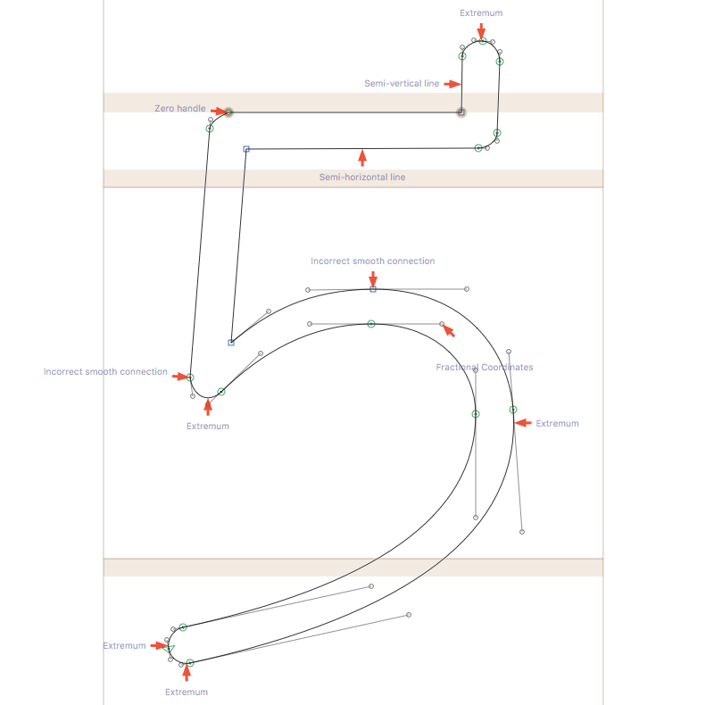

RedArrow-Glyphs
===============

Now Glyphs users can also have red arrows!

This plugin points at possible outline errors, like FontAudit in FontLab Studio. This version only works in Glyphs 2.2 and newer.

When the plugin is active, red arrows will point to possible mistakes in your outlines.

These kinds of errors are detected:

* Missing extremum points
* Fractional coordinates
* Fractional transformations
* Incorrect smooth connections
* Empty segments
* Collinear vectors
* Semi-horizontal and semi-vertical lines
* Zero handles

### Installation

Download the complete ZIP file and unpack it, or clone the repository.
Double click the .glyphsReporter file. Confirm the dialog that appears in Glyphs.

Restart Glyphs.

### Usage Instructions

#### To Display Outline Errors In The Current Glyph

Open a glyph in Edit View.
Use View > Show Red Arrows to toggle the arrows.

#### To Show/Hide Error Description Labels

In the glyph view, open the context menu and choose *Hide Error Labels*/*Show Error Labels.*

#### To Find All Glyphs With Outline Errors

Go to the Font overview tab and choose the master you want to check.
Use Edit > Select Glyphs With Outline Errors to select affected glyphs, then add a mark color to them, make a new list filter, or open a new tab. Whatever you like best that allows you to step through the glyphs and fix the outline errors.

### Known bugs

* Select Glyphs With Outline Errors doesn't catch errors in layers that are not in a master (exception layers).

This is a development version, so check back some time for updates.

Check the [issue tracker](https://github.com/jenskutilek/RedArrow-Glyphs/issues) and feel free to add any problems that you may encounter.
